# Segments
Aplikacja Segments służy do precyzyjnego planowania posiłków w oparciu o samodzielnie dodane przepisy.
Segments pozwala na zaplanowanie przygotowania posiłku i podzielenie go między wybrane dni w zależności od liczby porcji, konkretne określenie czasu przygotowania oraz wygodny odczyt przepisu podczas gotowania.

## Główne funkcjonalności:
Rejestracja oraz logowanie użytkowników
Dodawanie i usuwanie przepisu z możliwością pomiaru czasu przygotowania
Odczyt przepisu z funkcją blokującą wygaszanie ekranu
Zaplanowanie czasu na przygotowanie posiłku jako 'segment' w kalendarzu
Dystrybucja przygotowanych porcji między inne dni w kalendarzu
Konsekwentne usuwanie segmentów z kalendarza (usunięcie segmentu z przygotowaniem usuwa segmenty z porcjami)

## Najważniejsze wymagania

### Architektura aplikacji MVC/fronted-backend

Zapytania do bazy znajdują się w src/repository
Zapytaniami zarządzają kontrolery (src/controllers)
Za interfejs aplikacji odpowiadają pliki .html .css .js w folderach views, styles i scripts

### Diagram ERD 

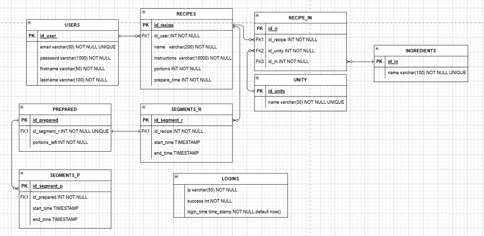

### Fetch API AJAX

W searchRecipe.js użyte jest Fetch API. Żądanie POST zostaje wysłane do backendu i w razie pomyślnego usunięcia przepisu strona jest przeładowywana

```js

        function confirmDelete() {
            if (!recipeIdToDelete) return;

            fetch('/delete_recipe', {
                method: 'POST',
                headers: {
                    'Content-Type': 'application/json'
                },
                body: JSON.stringify({ id_recipe: recipeIdToDelete })
            })
            .then(response => response.json())
            .then(data => {
                if (data.success) {
                    window.location.reload();
                } else {
                    alert("Could not delete recipe: " + (data.error || "Unknown error"));
                }
            })
            .catch(err => {
                console.error(err);
                alert("Network error");
            });
        }
```

### Design i responsywność

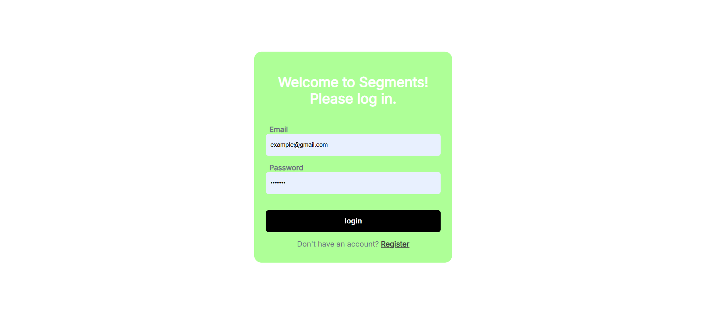
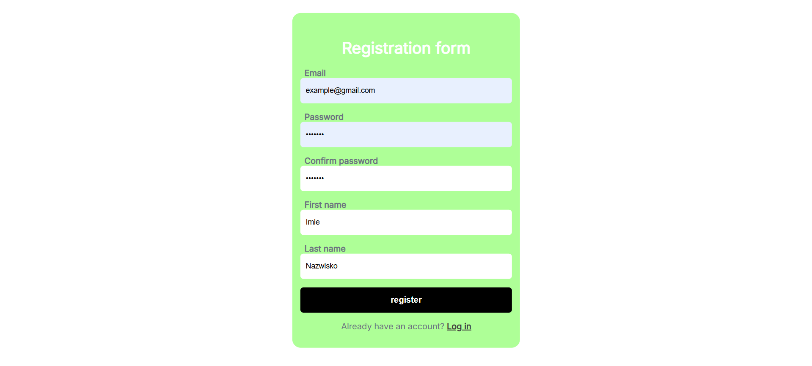

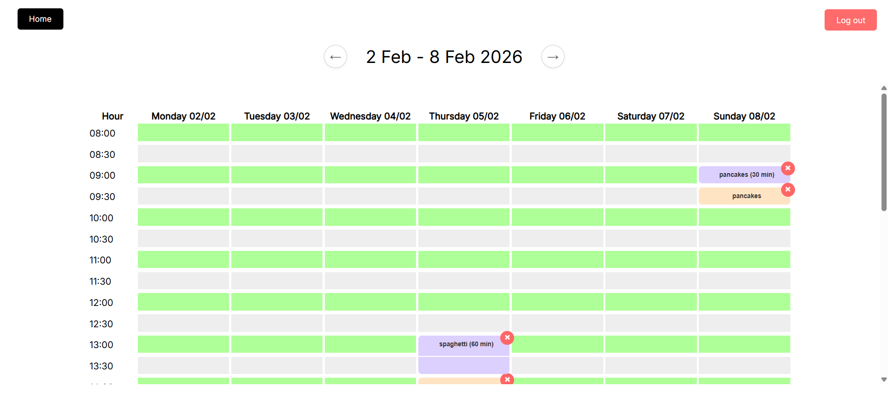
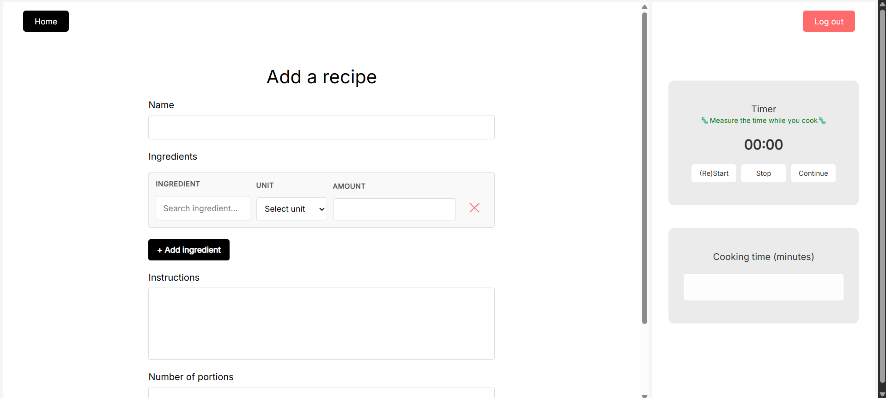
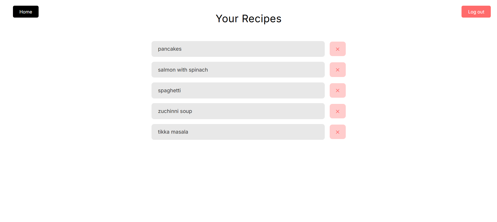
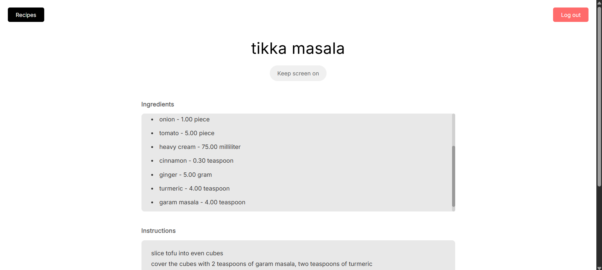

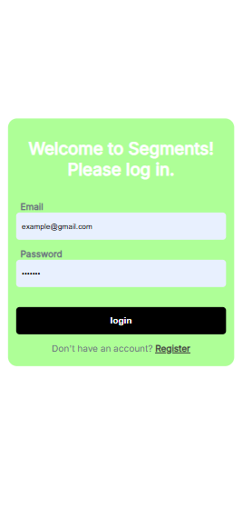
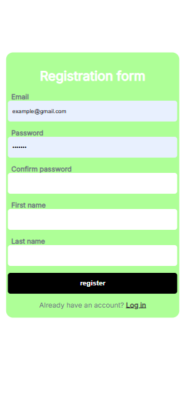
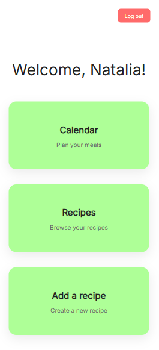
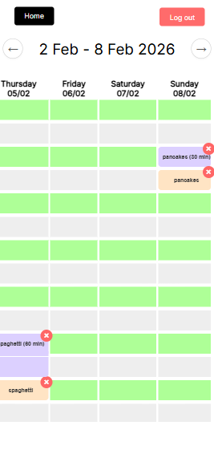
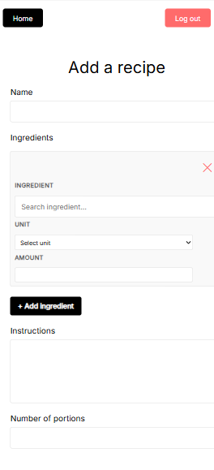
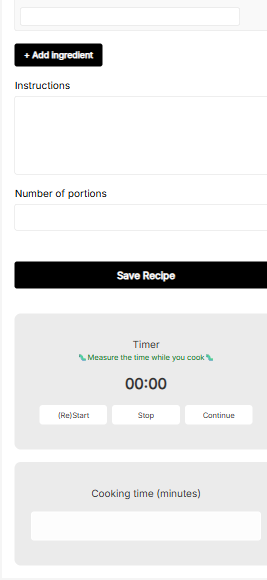
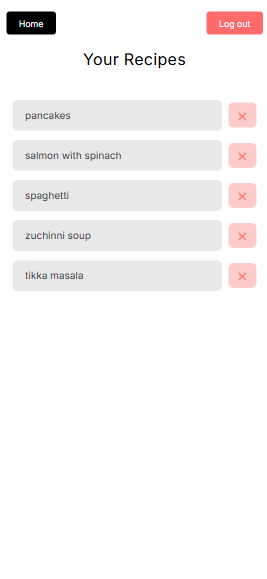
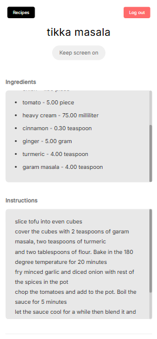
### Widoki, wyzwalacze i funkcje

Wyzwalacz i funkcja, które sprawiają, że zaplanowanie gotowania w kalendarzu
doda rekord z planowaną liczbą porcji do tabelki przygotowanych dań,
dzięki czemu użytkownik otrzyma informacje o dostępnych posiłkach i ich ilości przy dodawaniu kolejnych segmentów

```sql
CREATE OR REPLACE FUNCTION create_prepared()
RETURNS TRIGGER AS $$
BEGIN
  INSERT INTO PREPARED (id_segment_r, portions_left) 
  VALUES (NEW.id_segment_r, (SELECT portions FROM RECIPES WHERE id_recipe = NEW.id_recipe));
  RETURN NEW;
END;
$$ LANGUAGE plpgsql;

CREATE TRIGGER trg_create_prepared
AFTER INSERT ON SEGMENTS_R
FOR EACH ROW
EXECUTE FUNCTION create_prepared();
```

Wyzwalacz i funkcja, które sprawiają, że gdy użytkownik planuje w kalendarzu wykorzystanie posiłku to liczba dostępnych porcji związanych z danym przygotowaniem się zmniejsza o jeden

```sql
CREATE OR REPLACE FUNCTION decrease_portions()
RETURNS TRIGGER AS $$
BEGIN
  UPDATE PREPARED
  SET portions_left = portions_left - 1
  WHERE id_prepared = NEW.id_prepared;
  RETURN NEW;
END;
$$ LANGUAGE plpgsql;

CREATE TRIGGER trg_decrease_portions
AFTER INSERT ON SEGMENTS_P
FOR EACH ROW
EXECUTE FUNCTION decrease_portions();
```

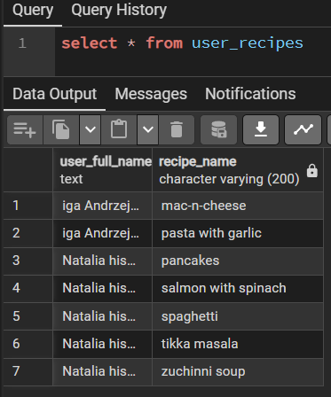
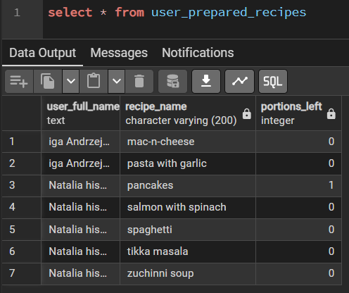

### Bezpieczeństwo

1. Ochrona przed SQL injection
2. Metoda login/register przyjmuje dane tylko na POST, GET tylko renderuje widok
3. Hasła nigdy nie są logowane w logach / errorach
4. Limit prób logowania / blokada czasowa po wielu nieudanych próbach
5. Zwracam sensowne kody HTTP (np. 400/401/403 przy błędach)
6. Nie zdradzam, czy email istnieje – komunikat typu „Email lub hasło niepoprawne”
7. Waliduję złożoność hasła (min. długość itd.)
8. Hasło nie jest przekazywane do widoków ani echo/var_dump
9. Przy rejestracji sprawdzam, czy email jest już w bazie
10. Hasła przechowywane jako hash (bcrypt/Argon2, password_hash)
11. Loguję nieudane próby logowania (bez haseł) do audytu
12. Mam poprawne wylogowanie – niszczę sesję użytkownika

